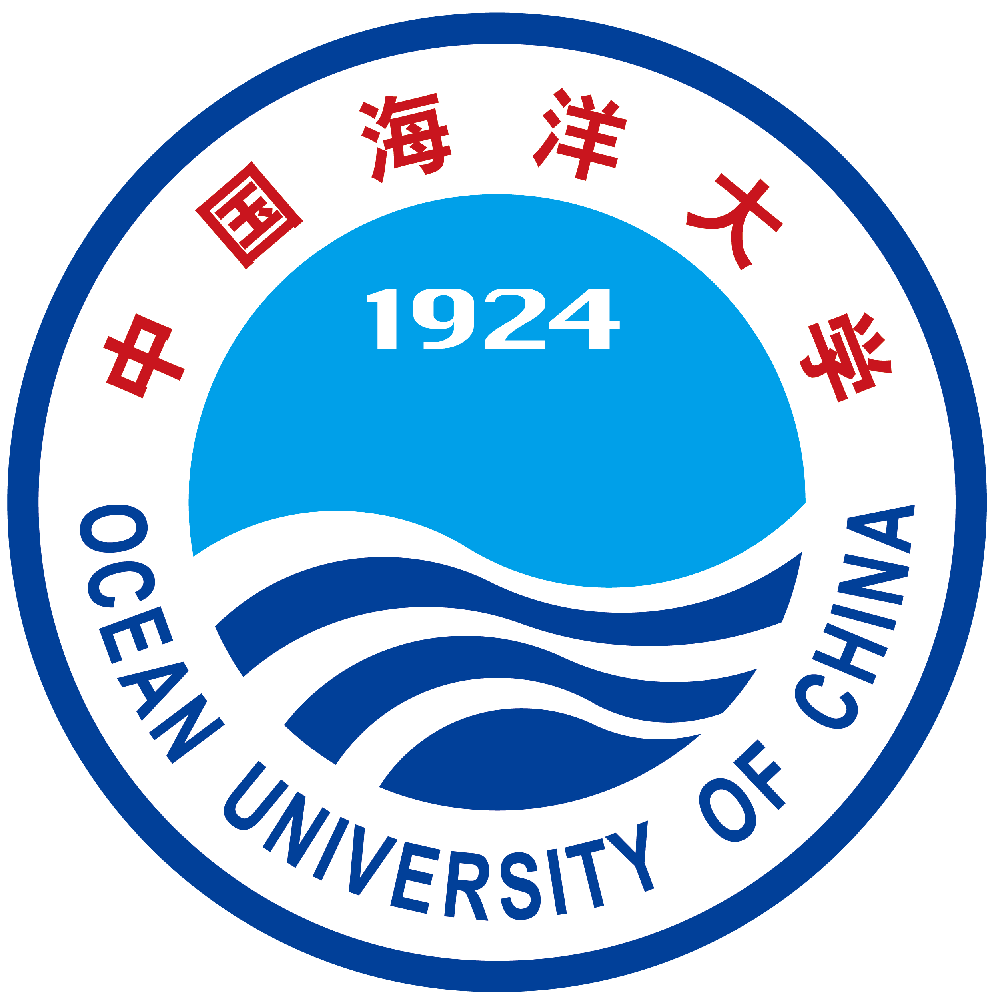

I'm currently working towards the Doctor of Engineering (D.Eng), advised by Pro.Xiujun Sun, with Ocean University of China and Laoshan Laboratory.

I have received my Bachelor's degree in *Intelligent Science and Technology* at Faculty of Information Science and Engineering of Ocean University of China (2019.08-2023.06)

My research interent lies in **AI for Marine Science**, including *Computer Science*, *Artifical Intelligence*, *Ocean Acoustics*.

  <!-- Ocean University of China 图片和字幕 -->
  
 <!-- 增加间隔 -->
    
    
 <!-- 增加顶部间距 -->
      <b>Ocean University of China</b> 
      Undergraduate 
      Aug. 19 - Jun. 23
    

  

  <!-- Ocean University of China 图片和字幕 -->
  
 <!-- 增加间隔 -->
    
    
 <!-- 增加顶部间距 -->
      <b>Ocean University of China</b> 
      Eng.D Candidate 
      Aug. 19 - Jun. 23
    

  

  
  <!-- National Laboratory 图片和字幕 -->
  

    
    
 <!-- 增加顶部间距 -->
      <b>Laoshan Laboratory</b> 
      Eng.D Candidate 
      Aug. 25 - Jun. 28
    

  

